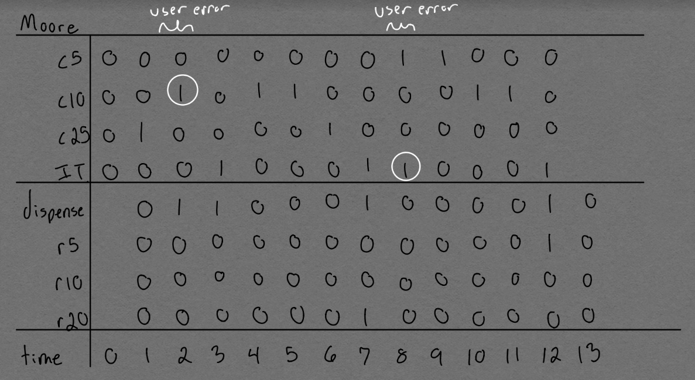
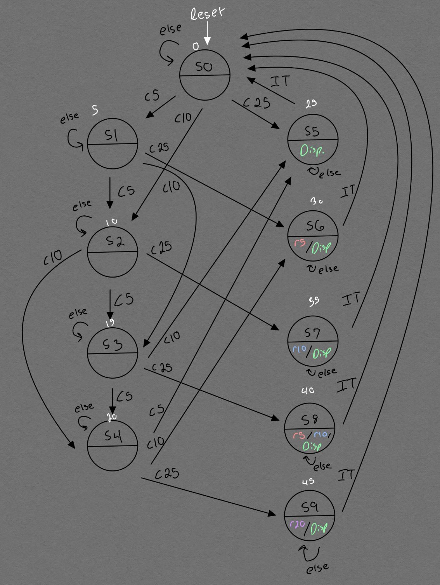
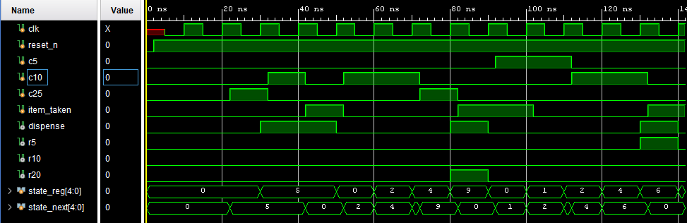
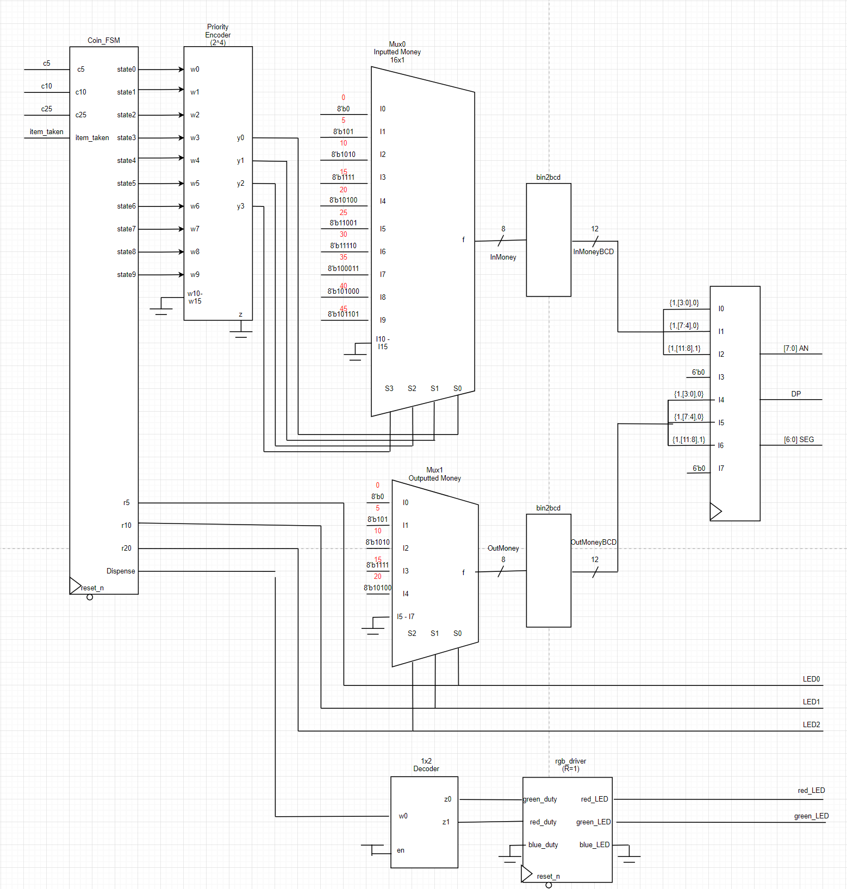
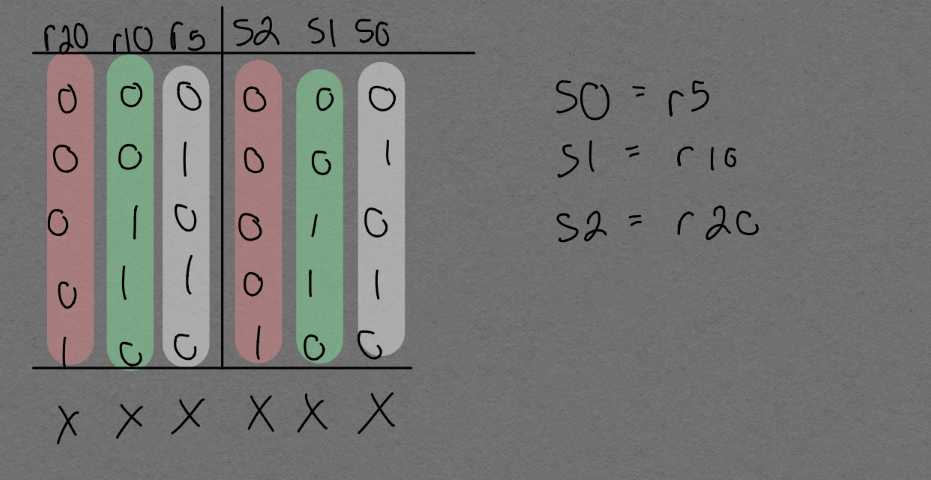
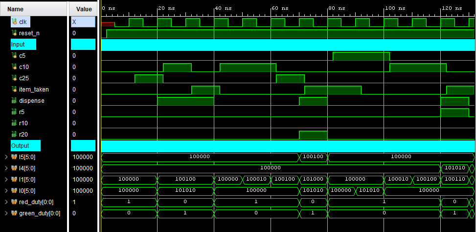

# Lab9
**Video Demo**
https://drive.google.com/file/d/1EGO91C9V5eyb46Kx22QEH86LyuLc9IPv/view?usp=sharing
**FSM**
* *State Diagram*

* *Coin FSM Test Bench*

**Circuit**
* *Vending Machine Block Diagram*

* *Mux 1 Select Logic*

* *Vending Machine Test Bench*

